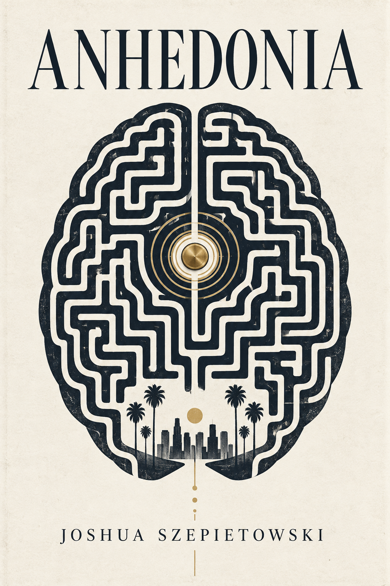

# Anhedonia

A philosophical literary hard sci-fi novel by Joshua Szepietowski.

## Core premise

A recovering addict in near-future Los Angeles qualifies for an invasive closed-loop neural implant originally developed to treat severe anhedonia. The device does not create pleasure. It modulates salience, making ordinary experience harder to dismiss and easier to remain engaged with.

The central question is not whether the technology works. It does. The question is what successful treatment does to agency, desire, recovery, and identity.

## Working themes

- Recovery versus state alteration
- Boredom as suffering versus boredom as information
- Salience, attention, and meaning
- Whether engineered contentment is authentic
- Personal identity after neurotechnology changes desire
- The difference between craving pleasure and craving a change in consciousness
- Human connection as an alternative to compulsive state change

## Project structure

- `manuscript/` - prose drafts and chapters
- `notes/` - characters, worldbuilding, themes, and research notes
- `assets/cover.png` - current working cover
- `.vscode/` - editor settings
